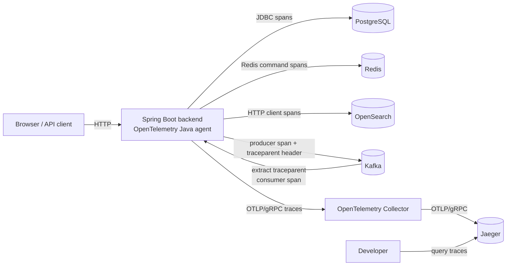

# Log Analyzer

A developer workspace built with React, TypeScript, Vite, Java 21, Spring Boot, PostgreSQL, Kafka, Redis, OpenSearch, and OpenTelemetry. It provides asynchronous REST log ingestion, durable PostgreSQL storage, full-text log search, and end-to-end traces in Jaeger.

## Start with Docker Compose

Prerequisites: Docker Desktop (or Docker Engine with Compose v2.20+) running, available ports 3000, 3001, 4317, 4318, 5432, 6379, 8080, 9090, 9200, 16686, and 29092, and internet access for the first image/dependency download. Host Node.js, Maven, and Java are not required for the Docker workflow.

From the repository root:

```sh
docker compose up --build -d --wait --wait-timeout 180
```

The first build may take several minutes. Both application image builds run their tests. PostgreSQL, Redis, Kafka, OpenSearch, the OpenTelemetry Collector, and Jaeger start before the instrumented backend. The backend must become healthy before the frontend starts.

| Service | Address |
| --- | --- |
| Frontend | http://localhost:3000 |
| Backend health | http://localhost:8080/api/health |
| Health through the frontend proxy | http://localhost:3000/api/health |
| PostgreSQL | localhost:5432 |
| Redis | localhost:6379 |
| Kafka | localhost:29092 |
| OpenSearch | http://localhost:9200 |
| Prometheus | http://localhost:9090 |
| Grafana | http://localhost:3001 |
| Jaeger trace UI | http://localhost:16686 |
| OpenTelemetry OTLP/gRPC | localhost:4317 |
| OpenTelemetry OTLP/HTTP | localhost:4318 |

Open the frontend to see the backend connection status, database availability, request duration, and recent health checks. The Health API route shows the actual JSON response. Checks refresh every 30 seconds and can also be triggered manually or paused. The latest eight checks are kept only in browser memory. Frontend status means the page has loaded; it is not an independent server probe.

```sh
docker compose ps
curl --fail http://localhost:3000/api/health
docker compose logs -f backend
```

Stop the stack while preserving database data:

```sh
docker compose down
```

To deliberately delete all local database data as well, run `docker compose down -v`. Do not use `-v` when data must be retained.

## Configuration

Defaults work without an environment file. To override them, create a root `.env` using `.env.example` as a reference. Compose reads this file automatically; it is excluded from git.

| Variable | Default |
| --- | --- |
| `FRONTEND_PORT` | `3000` |
| `BACKEND_PORT` | `8080` |
| `POSTGRES_PORT` | `5432` |
| `POSTGRES_DB` | `log_analyzer` |
| `POSTGRES_USER` | `log_analyzer` |
| `POSTGRES_PASSWORD` | `local_dev_password` |
| `REDIS_PORT` | `6379` |
| `KAFKA_PORT` | `29092` |
| `OPENSEARCH_PORT` | `9200` |
| `OTEL_GRPC_PORT` | `4317` |
| `OTEL_HTTP_PORT` | `4318` |
| `JAEGER_UI_PORT` | `16686` |
| `PROMETHEUS_PORT` | `9090` |
| `GRAFANA_PORT` | `3001` |
| `LOG_INGESTION_MAX_ATTEMPTS` | `3` |
| `LOG_INGESTION_RETRY_INTERVAL` | `2s` |
| `DEMO_INGESTION_FAILURES_ENABLED` | `true` in Compose |
| `DLQ_DEMO_TRACE_ID` | `demo-dlq-trace-001` |

For a port conflict, choose a free host port, for example:

```sh
FRONTEND_PORT=3001 docker compose up --build -d --wait
```

Internal service ports and the frontend API URL do not change. All published ports bind to localhost. Credentials are local development defaults, not production secrets. There is no authentication or TLS in this initial local scaffold. PostgreSQL initialization variables apply only to an empty volume; changing credentials later requires updating the database itself or explicitly resetting disposable data.

## Repository Layout

```text
frontend/
  src/
    api/          Typed HTTP client and response validation
    components/   Shared status and refresh controls
    hooks/        Health polling and session history
    pages/        Overview and API response routes
    App.tsx       React Router and workspace layout
  Dockerfile      Vite build and unprivileged Nginx runtime
  nginx.conf      Same-origin /api proxy and SPA fallback
backend/
  src/main/java/dev/loganalyzer/
    controller/   HTTP routing and response codes
    service/      Health behavior
    repository/   JDBC health probe and JPA repository
    entity/       Initial LogEntry persistence model
    dto/          Public health response contract
    messaging/    Versioned Kafka events, producers, consumers, and topic configuration
    search/       OpenSearch mapping, indexing, and query adapter
  src/main/resources/db/migration/
                  Versioned PostgreSQL schema (Flyway)
  src/test/       Health endpoint tests
  Dockerfile      Maven build and non-root Java 21 runtime
observability/
  otel-collector-config.yml
                  OTLP receiver and Jaeger trace exporter
  prometheus.yml  Backend scrape configuration
  grafana/        Provisioned data source and operations dashboards
docker-compose.yml
```

The Kafka consumer persists logs submitted through `POST /api/logs`. Logs can be filtered through `GET /api/logs`, and the operational overview is aggregated by PostgreSQL through `GET /api/logs/overview`. Text searches use OpenSearch to identify matching event IDs and then hydrate the response from PostgreSQL. Flyway owns schema changes; Hibernate validates the schema at startup.

### Live log updates

`GET /api/logs/stream` is a Server-Sent Events endpoint that supplements the paginated `GET /api/logs` API. It does not replay history. After a new log transaction commits, the backend broadcasts one compact `log` event containing only the database row ID, timestamp, service name, environment, severity, message, and trace ID.

The React log explorer keeps its normal REST query for initial loading, pagination, filtering, and authoritative refreshes. On unfiltered newest-first page 0, compact SSE events are deduplicated by row ID and prepended immediately. On filtered results, oldest-first sorting, or later pages, the UI shows a **new logs available** action instead of inserting an event that may not belong in the current result set.

The page displays `Live`, `Connecting`, `Reconnecting`, or `Disconnected` status. The client reconnects with exponential backoff capped at 15 seconds. The server sends 15-second heartbeat comments, removes closed emitters, and tells clients to retry after two seconds. Nginx disables buffering only for the SSE route and keeps the standard timeout behavior for other REST calls.

## Distributed Tracing Architecture

The backend container runs with the OpenTelemetry Java agent. It automatically instruments incoming Spring MVC requests, Kafka publishing and consumption, PostgreSQL JDBC calls, Lettuce Redis commands, and HTTP requests to OpenSearch. Application code remains independent of the OpenTelemetry SDK.



The agent injects W3C `traceparent` and `tracestate` headers into Kafka records and extracts them in listener threads. An ingestion HTTP request, `logs.raw` persistence, `logs.persisted` publication, and OpenSearch indexing therefore retain one OpenTelemetry trace ID while each operation receives its own span ID.

Backend console output uses Spring Boot's Logstash JSON format. Logs created inside an instrumented operation include `trace_id`, `span_id`, and `trace_flags` from the agent plus the existing business `correlationId`. The OpenTelemetry `trace_id` is technical execution context; the log payload's `traceId` remains the application field used by the trace log-correlation view.

The backend exports traces only. Existing Prometheus metrics remain on `/actuator/prometheus`, and application logs remain on stdout. The Collector receives OTLP on ports 4317 and 4318, batches spans, and exports them to Jaeger. Open http://localhost:16686 and select `log-analyzer-backend` to inspect traces.

## Ingest Logs

`POST /api/logs` validates the JSON, publishes a `LogRawEventV1` event to the `logs.raw` Kafka topic, and returns HTTP 202 without waiting for PostgreSQL. Required fields are `timestamp`, `serviceName`, `environment`, `severity`, `message`, and `host`. `severity` must be `DEBUG`, `INFO`, `WARN`, or `ERROR`; `traceId` and `metadata` are optional.

The response contains `eventId`, `correlationId`, and `status: "accepted"`. Clients may supply `X-Correlation-ID`; otherwise the backend generates one and returns it in both the response header and body. Publishing and consumption logs include that correlation ID. HTTP 202 means the event was accepted for asynchronous publishing, not that it is already queryable from PostgreSQL.

Send an INFO log:

```sh
curl --fail-with-body -X POST http://localhost:8080/api/logs \
  -H 'Content-Type: application/json' \
  -d '{"timestamp":"2026-09-17T12:00:00Z","serviceName":"catalog-api","environment":"development","severity":"INFO","message":"Catalog refresh completed","host":"catalog-01","metadata":{"itemCount":128}}'
```

Send a WARN log:

```sh
curl --fail-with-body -X POST http://localhost:8080/api/logs \
  -H 'Content-Type: application/json' \
  -d '{"timestamp":"2026-09-17T12:01:00Z","serviceName":"checkout-api","environment":"staging","severity":"WARN","message":"Payment provider response was slow","traceId":"trace-456","host":"checkout-02","metadata":{"durationMs":2400}}'
```

Send an ERROR log:

```sh
curl --fail-with-body -X POST http://localhost:8080/api/logs \
  -H 'Content-Type: application/json' \
  -d '{"timestamp":"2026-09-17T12:02:00Z","serviceName":"billing-api","environment":"production","severity":"ERROR","message":"Payment capture failed","traceId":"trace-789","host":"billing-01","metadata":{"provider":"example-pay","retryable":true}}'
```

Invalid JSON or validation failures return HTTP 400 with field details where available. Unexpected failures return HTTP 500 with a generic message; server details remain in backend logs.

### Asynchronous ingestion architecture

The original synchronous path kept the HTTP request open while JPA inserted the row:

```text
HTTP POST -> validation -> PostgreSQL insert -> HTTP 201
```

The asynchronous path removes PostgreSQL from the request lifecycle:

```text
HTTP POST -> validation -> logs.raw publish -> HTTP 202
                                |
                                v
                    Spring Kafka consumer -> PostgreSQL insert
                                                    |
                                                    v after commit
                                           logs.persisted publish
                                                    |
                                                    v
                                      OpenSearch indexing consumer
```

Kafka decouples request latency from database writes and buffers accepted traffic while the consumer catches up. This introduces eventual consistency: a successful POST may not appear in `GET /api/logs` immediately. The event name and `schemaVersion` are explicitly versioned; incompatible future schemas should use a new event model and consumer path rather than silently changing V1.

### At-least-once delivery and idempotency

Every accepted request receives a UUID `LogRawEventV1.eventId` before it is published. Kafka provides at-least-once delivery, so the same event may reach the consumer more than once after retries, rebalances, or acknowledgment failures. PostgreSQL stores the event ID in `log_entries.ingestion_event_id`, protected by the unique `uq_log_entries_ingestion_event_id` index.

The consumer does not use a check-then-insert sequence because two consumers could both observe that a row is absent and then race to insert it. Instead, persistence uses one atomic PostgreSQL `INSERT ... ON CONFLICT DO NOTHING` statement. The first delivery creates the row; concurrent or later deliveries with the same event ID affect zero rows and are treated as successful duplicates. This keeps duplicate handling inside the same database operation, avoids transaction rollback from a unique-constraint exception, and allows Kafka to acknowledge the duplicate safely.

Each ignored duplicate increments the Micrometer counter `log_analyzer.ingestion.duplicates`, exposed as `log_analyzer_ingestion_duplicates_total` in Prometheus.

### PostgreSQL and OpenSearch responsibilities

PostgreSQL remains the durable source of truth. It owns complete log records, ingestion idempotency, transactional writes, filtered listing without text search, overview aggregation, and API response data. OpenSearch is an eventually consistent search projection; it is not used to authorize writes or replace PostgreSQL records.

After a new log transaction commits, the backend publishes `LogPersistedEventV1` to `logs.persisted`. Duplicate `logs.raw` deliveries do not publish additional persisted events. A separate consumer indexes the event into the `logs-v1` OpenSearch index using `eventId` as the document ID, making repeated indexing idempotent.

The index mapping uses:

- `message` as analyzed `text`.
- `serviceName`, `severity`, `traceId`, and `environment` as exact `keyword` fields with analyzed `.search` subfields.
- `timestamp` as `date` and `eventId` as `keyword`.

When `GET /api/logs` includes the `search` parameter, OpenSearch performs multi-field text matching across message, service name, severity, trace ID, and environment. Any structured service, severity, trace ID, environment, and timestamp parameters are applied as OpenSearch filters in the same query. OpenSearch returns ordered event IDs; the backend loads those records from PostgreSQL before returning them. Without `search`, filtering and pagination remain PostgreSQL queries.

The search box supports plain terms and four allowlisted field tokens:

```text
severity:ERROR service:payment-service environment:production traceId:trace-42 payment timeout
```

Token values may be quoted when they contain spaces. Unknown prefixes are treated as ordinary search text; the API never accepts OpenSearch query JSON, scripts, regular expressions, or arbitrary field names. Explicit `severity`, `serviceName`, `environment`, and `traceId` query parameters override values embedded in the search string. Invalid severity values and queries longer than 500 characters return HTTP 400.

Sorting is restricted to `sort=timestamp,desc` for newest-first or `sort=timestamp,asc` for oldest-first. Search responses include `totalRecords` and `queryExecutionMs`. The React explorer displays both values and highlights plain query terms in returned messages.

Saved searches are durable PostgreSQL records, not OpenSearch documents. The `saved_searches` table stores a typed name, query, structured filters, timestamp range, sort direction, and creation time. This prevents saved definitions from containing arbitrary search-engine JSON.

- `GET /api/saved-searches` lists saved definitions by name.
- `POST /api/saved-searches` creates a definition and returns HTTP 201.
- `DELETE /api/saved-searches/{id}` removes a definition and returns HTTP 204.

### Trace log correlation

`GET /api/traces/{traceId}` reads all PostgreSQL log rows with the exact trace ID and returns them in timestamp order. The response includes the first and last timestamps, elapsed duration, an ordered sequence of distinct services, and the complete log events. Trace IDs in the log table link to the React trace sequence view, where WARN and ERROR events receive stronger visual emphasis.

This feature is log correlation only. It groups existing records by `traceId`; it does not model spans, parent-child relationships, sampling, critical paths, or other distributed tracing semantics.

### Alert rules

The Alerts route defines simple PostgreSQL-backed threshold rules of the form:

```text
ERROR count for payment-service > 20 during 5 minutes
```

Rules contain a name, exact service name, count threshold, evaluation window, cooldown, and active flag. This initial implementation intentionally supports only ERROR-count greater-than conditions; it does not expose a general expression language. The scheduled evaluator runs every 30 seconds by default (`ALERT_EVALUATION_INTERVAL`) and counts recent durable PostgreSQL log rows, so OpenSearch availability does not affect alert decisions.

Alert lifecycle:

- A true condition creates one `OPEN` alert when no active alert exists and cooldown has expired.
- Continued true evaluations do not create duplicates. A PostgreSQL partial unique index permits only one `OPEN` or `ACKNOWLEDGED` alert per rule.
- An operator may move `OPEN` to `ACKNOWLEDGED`, or resolve either active state manually.
- When the condition clears, the evaluator automatically moves either active state to `RESOLVED`.
- Cooldown starts at resolution and suppresses reopening until it expires. Pausing a rule resolves its active alert.

The backend exposes `GET` and `POST /api/alerts/rules`, `PATCH /api/alerts/rules/{id}/active`, paginated `GET /api/alerts`, and `POST /api/alerts/{id}/acknowledge|resolve`. Alerts are currently visible only in the React Alerts page; email, paging, and other external notifications are deliberately out of scope.

Indexing is asynchronous, so a newly persisted log can briefly appear in PostgreSQL-backed listings before it appears in text search. If OpenSearch is unavailable, PostgreSQL data remains intact, but text search and new projection updates are unavailable until OpenSearch recovers.

### Retries and dead-letter handling

A **transient error** is expected to recover without changing the event, such as a temporary PostgreSQL connection failure. The consumer retries these failures twice after the initial attempt by default, waiting two seconds between attempts. Configure the total attempt count with `LOG_INGESTION_MAX_ATTEMPTS` and the delay with `LOG_INGESTION_RETRY_INTERVAL`.

A **permanent error** means retrying the same event cannot make it valid, such as an unsupported `LogRawEventV1.schemaVersion`. Permanent validation failures skip automatic retries. When processing is exhausted, Kafka stores the original event on `logs.raw.dlq` with exception headers. A separate consumer projects the original event, failure reason, automatic retry count, and failure timestamp into PostgreSQL's `dead_letter_events` table for inspection. Its finite error policy never republishes onto `logs.raw.dlq`, preventing a dead-letter loop.

View failures in the **Failed ingestion** frontend route or request them directly:

```sh
curl --fail-with-body 'http://localhost:8080/api/dead-letter-events?page=0&size=20'
```

Manual retry is an explicit operator action. It republishes the stored original event once to `logs.raw`, where the normal bounded retry policy applies. Each dead-letter event permits at most three manual retries and remains in the audit table, so repeated failures cannot create an automatic replay loop:

```sh
curl --fail-with-body -X POST \
  http://localhost:8080/api/dead-letter-events/INGESTION_EVENT_ID/retry
```

#### Generate the retry and DLQ demo

Local Compose enables one isolated demo failure marker by default. Normal events are unaffected; only an event with exact metadata `"demoFailure":"retry-to-dlq"` throws the demo-only retryable exception. The one-shot generator mode sends that marker through the normal `POST /api/logs` path:

```sh
docker compose --profile demo run --rm dlq-demo
```

The command sends one event from `dlq-demo-service`, exits immediately, and prints its ingestion `eventId`. With the default retry settings, allow about five seconds for the initial attempt plus two automatic retries. The exhausted Kafka record moves to `logs.raw.dlq`, and the existing DLQ consumer stores its original event, failure reason, retry count, and failure timestamp in PostgreSQL.

Open the Failed ingestion page and refresh:

http://localhost:3000/failed-ingestions

The row shows `dlq-demo-service`, the original event ID, the reason **Demo ingestion failure requested; retrying before logs.raw.dlq**, and `2 auto / 0 manual`. Click **Retry** to use the existing manual replay endpoint. For this demo event only, replay removes the `demoFailure` marker while preserving the original event ID and all other metadata. The normal consumer then persists it successfully; the audit row remains and changes to `2 auto / 1 manual`.

The equivalent host command is:

```sh
node tools/log-generator/generator.js \
  --scenario dlq-demo \
  --trace-id demo-dlq-trace-001 \
  --environment demo \
  --url http://127.0.0.1:8080/api/logs
```

Screen-recording sequence:

1. Open the empty or existing [Failed ingestion page](http://localhost:3000/failed-ingestions).
2. In a terminal, run `docker compose --profile demo run --rm dlq-demo` and point out the printed `eventId`.
3. Mention that the backend is making three total attempts; wait about five seconds.
4. Refresh the page and show the service, original event ID, deterministic reason, and `2 auto / 0 manual`.
5. Click **Retry** and show the manual count change to `1`.
6. Open the Logs page and filter by service `dlq-demo-service` to show that replay reached PostgreSQL through the normal Kafka consumer.

Set `DEMO_INGESTION_FAILURES_ENABLED=false` to disable the marker entirely. This demo does not stop PostgreSQL, affect unrelated events, bypass Kafka, or insert a `dead_letter_events` row directly.

### Generate development traffic

The dependency-free generator in `tools/log-generator` sends realistic logs from payment, order, user, and inventory services. It supports normal traffic, elevated warnings, database timeouts, payment failures, and periodic error spikes.

Run it from the command line with Node.js 22+:

```sh
node tools/log-generator/generator.js --scenario normal --rps 10 --duration 60
```

When `BACKEND_PORT` is customized, pass the published port explicitly, for example `--url http://127.0.0.1:8088/api/logs`.

Run it in Docker Compose against the Compose backend:

```sh
LOG_SCENARIO=error-spike LOG_RPS=20 LOG_DURATION=60 \
  docker compose --profile generator up --build log-generator
```

`LOG_DURATION=0` runs continuously until stopped. Configure services with `--services payment-service,order-service` or `LOG_SERVICES`; configure severity-specific text with `--messages-file tools/log-generator/messages.example.json`. Available scenarios are `normal`, `warnings`, `database-timeouts`, `payment-failures`, `error-spike`, and the finite `trace-demo`. Run `node tools/log-generator/generator.js --help` for all CLI and environment options.

Open the dashboard while traffic is running and use **Refresh** on the Overview or Logs page to see the latest data.

### Generate the trace-correlation demo

The finite `trace-demo` scenario posts exactly four events through the normal `POST /api/logs` endpoint, so they pass through Kafka, PostgreSQL persistence, live updates, and OpenSearch indexing. It uses one shared trace ID and a fixed service/message sequence with timestamps spaced 250 ms apart:

```text
api-gateway INFO
  -> order-service INFO
  -> payment-service ERROR
  -> inventory-service INFO
```

With the Compose stack running, execute the one-shot demo service:

```sh
docker compose --profile demo run --rm trace-demo
```

Then open the trace sequence directly:

http://localhost:3000/traces/demo-checkout-trace-001

To use a different predictable ID for a recording, override it explicitly:

```sh
TRACE_DEMO_ID=recording-checkout-001 \
  docker compose --profile demo run --rm trace-demo
```

The equivalent host command is:

```sh
node tools/log-generator/generator.js \
  --scenario trace-demo \
  --trace-id demo-checkout-trace-001 \
  --environment demo \
  --url http://127.0.0.1:8080/api/logs
```

The command exits after all four requests succeed and prints the trace ID. Reusing the same trace ID intentionally appends another four events to that correlated trace, so choose a fresh `TRACE_DEMO_ID` when a clean recording is needed.

## Operational Overview

`GET /api/logs/overview` requires `startTimestamp` and `endTimestamp` ISO-8601 query parameters. The period is half-open: the start is included and the end is excluded. PostgreSQL returns total logs, ERROR and WARN counts, active services, logs grouped by service and severity, hourly log volume, and errors grouped by service using bounded `GROUP BY` queries.

```sh
curl --fail-with-body 'http://localhost:8080/api/logs/overview?startTimestamp=2026-09-16T12%3A00%3A00Z&endTimestamp=2026-09-17T12%3A00%3A00Z'
```

The Overview route provides 1-hour, 6-hour, 24-hour, and 7-day periods with summary cards, an hourly volume chart, and errors by service. PostgreSQL remains the durable source of truth. Redis caches the complete overview response for 45 seconds because these repeated aggregation queries are comparatively expensive. Cache keys include the exact start and end timestamps, so different dashboard periods cannot collide. The short TTL bounds staleness for rapidly changing logs; writes do not invalidate or populate the cache.

Individual log writes, single-log reads, and filtered or paginated log searches are intentionally not cached. Those paths either change durable state or need current row-level data, so caching would add invalidation complexity without the same aggregation benefit.

Spring Boot Actuator and Micrometer expose Prometheus metrics directly from the backend at `GET /actuator/prometheus`. The Compose backend port is bound to `127.0.0.1`, and Nginx explicitly rejects `/actuator/*`, so metrics are available to local development tools without being exposed through the frontend proxy. The general `/actuator/metrics` discovery endpoint is not exposed.

```sh
curl --fail http://localhost:8080/actuator/prometheus
```

Standard Micrometer binders publish JVM, process, HikariCP, HTTP server, Kafka client, and Spring Cache metrics. Redis-backed overview cache activity appears as `cache_gets_total` with fixed `cache="log-overview"` and `result="hit"` or `result="miss"` labels.

Custom metrics use the `log_analyzer_` Prometheus prefix:

| Prometheus metric | Type | Meaning |
| --- | --- | --- |
| `log_analyzer_ingestion_received_total` | Counter | Valid log requests received by the ingestion publisher |
| `log_analyzer_kafka_published_total{topic}` | Counter | Successful application Kafka sends for `logs.raw` or `logs.persisted` |
| `log_analyzer_kafka_consumed_total{topic}` | Counter | Kafka deliveries received from `logs.raw` or `logs.persisted` |
| `log_analyzer_ingestion_failures_total` | Counter | Failed raw publishing or consumer processing attempts |
| `log_analyzer_ingestion_retries_total` | Counter | Kafka ingestion redelivery attempts |
| `log_analyzer_dlq_events_total` | Counter | Events consumed from `logs.raw.dlq` |
| `log_analyzer_ingestion_duplicates_total` | Counter | Duplicate events ignored by PostgreSQL idempotency |
| `log_analyzer_opensearch_indexing_failures_total` | Counter | Failed OpenSearch indexing attempts |
| `log_analyzer_postgresql_persistence_seconds` | Timer | Time spent performing the atomic PostgreSQL insert |
| `log_analyzer_ingestion_end_to_end_seconds` | Timer | Time from the `logs.raw` Kafka timestamp through successful PostgreSQL persistence |

The latency timers publish count, sum, maximum, and histogram buckets. Custom metrics do not use trace IDs, event IDs, log messages, service names, or exception text as labels. The only custom label is the bounded Kafka topic set.

## Operations Dashboards

Prometheus scrapes `http://backend:8080/actuator/prometheus` every 15 seconds over the internal Compose network and stores metrics in the `prometheus_data` volume. Grafana is preconfigured with Prometheus as its default data source and loads dashboards from version-controlled JSON on startup. Anonymous Viewer access is enabled only on the localhost-bound development port, so no manual data-source or dashboard setup is required.

Open Grafana at http://localhost:3001 and use the **Log Analyzer** folder:

- [Log Analyzer - Application Health](http://localhost:3001/d/log-analyzer-health/log-analyzer-application-health) shows backend availability, HTTP request rate, HTTP 5xx ratio, average request latency, JVM memory, and process/system CPU.
- [Log Analyzer - Processing Pipeline](http://localhost:3001/d/log-analyzer-pipeline/log-analyzer-processing-pipeline) shows received logs per second, Kafka consumer throughput and available lag, p95 and average ingestion latency, p95 and average PostgreSQL persistence latency, Redis overview-cache hit ratio, OpenSearch indexing failures, ingestion retries, ingestion failures, and DLQ events.

These are operator dashboards for the Log Analyzer service itself. The React application at http://localhost:3000 remains the product interface for searching, inspecting, and correlating application logs; it does not embed or duplicate Grafana dashboards.

Provisioning files live under `observability/grafana`, and dashboard changes should be made there rather than through the Grafana UI. Prometheus and Grafana data are retained in named volumes across normal `docker compose down` operations.

## Health Contract

`GET /api/health` performs a bounded PostgreSQL `SELECT 1` through controller, service, and repository layers. A successful check returns HTTP 200:

```json
{
  "status": "UP",
  "service": "log-analyzer",
  "database": "UP",
  "timestamp": "2026-09-17T12:00:00Z"
}
```

A database failure returns HTTP 503 with `status` and `database` set to `DOWN`, without exposing connection details. This is a readiness check, not a liveness endpoint. If PostgreSQL is unavailable at startup, Flyway prevents the backend from starting. The frontend distinguishes a database failure from an unreachable backend and times out requests after six seconds.

In Docker, Nginx forwards `/api/*` to `backend:8080` using Docker DNS. In local development, Vite forwards the same path to `localhost:8080`. The browser never resolves Docker service names and no cross-origin configuration is needed. Nginx also supports direct navigation to React Router paths such as `/api-details`.

## Develop Without Application Containers

Use Node.js 22.12+ (or a compatible newer LTS), Java 21, and Maven 3.9+. Start the data services:

```sh
docker compose up -d --wait postgres redis kafka kafka-init opensearch jaeger otel-collector
```

In one terminal:

```sh
cd backend
mvn spring-boot:run
```

In another:

```sh
cd frontend
npm ci
npm run dev
```

Vite prints its URL, normally http://localhost:5173. Stop the Compose frontend/backend first if they are already running (`docker compose stop frontend backend`). The backend defaults match the default Compose data services. With custom settings, explicitly export `DB_URL`, `DB_USERNAME`, `DB_PASSWORD`, `REDIS_HOST`, `REDIS_PORT`, `KAFKA_BOOTSTRAP_SERVERS`, and `OPENSEARCH_URL` before running Maven; the backend does not read the root `.env` itself. The OpenTelemetry Java agent is attached by the backend Docker image; a backend started directly with Maven is not automatically instrumented unless an agent is supplied through `JAVA_TOOL_OPTIONS`. For a different backend port, set Spring's `SERVER_PORT` and pass `API_PROXY_TARGET=http://localhost:<port>` to `npm run dev`.

## Checks

```sh
cd frontend
npm ci
npm test
npm run lint
npm run build
```

```sh
cd backend
mvn test
```

Backend unit tests do not require external services. Controller integration tests use Testcontainers PostgreSQL and Kafka and require a running Docker daemon. `docker compose build` executes both projects' tests in their specified build environments. The live Compose health check validates real PostgreSQL connectivity and migration startup.

To check outage handling on this disposable development stack, stop PostgreSQL with `docker compose stop postgres`, refresh the UI, and expect HTTP 503 with database status `DOWN`. Restore it with `docker compose up -d --wait postgres backend frontend`. The backend reconnects without a rebuild.

## Scope

Frontend, backend, PostgreSQL, Kafka, Redis, OpenSearch, Prometheus, Grafana, the OpenTelemetry Collector, and Jaeger are configured. Kafka handles asynchronous persistence through `logs.raw` and search projection through `logs.persisted`. Redis is limited to short-lived product-dashboard aggregation caching, PostgreSQL remains durable storage, and OpenSearch serves full-text queries. Prometheus stores operational metrics, Grafana renders provisioned operations dashboards, and Jaeger stores local development traces in memory.

## Troubleshooting

- If Docker cannot connect, start Docker Desktop and retry.
- For startup failures, inspect `docker compose logs backend postgres redis kafka kafka-init opensearch prometheus grafana otel-collector jaeger` and `docker compose ps`.
- If Grafana panels are empty, confirm `http://localhost:9090/targets` reports `log-analyzer-backend` as UP and generate traffic through the React app or log generator.
- For missing traces, verify `curl http://localhost:16686/api/services` lists `log-analyzer-backend`, then inspect Collector logs for OTLP export errors.
- For a disconnected UI, check both the direct and proxied health URLs above. A 502 indicates the proxy cannot reach the backend; a JSON 503 indicates a database problem.
- To apply source changes to Docker images, rerun `docker compose up --build -d --wait`.
- UI fonts are loaded from Google Fonts, with local sans-serif/monospace fallbacks when offline. Application behavior does not depend on that font request.